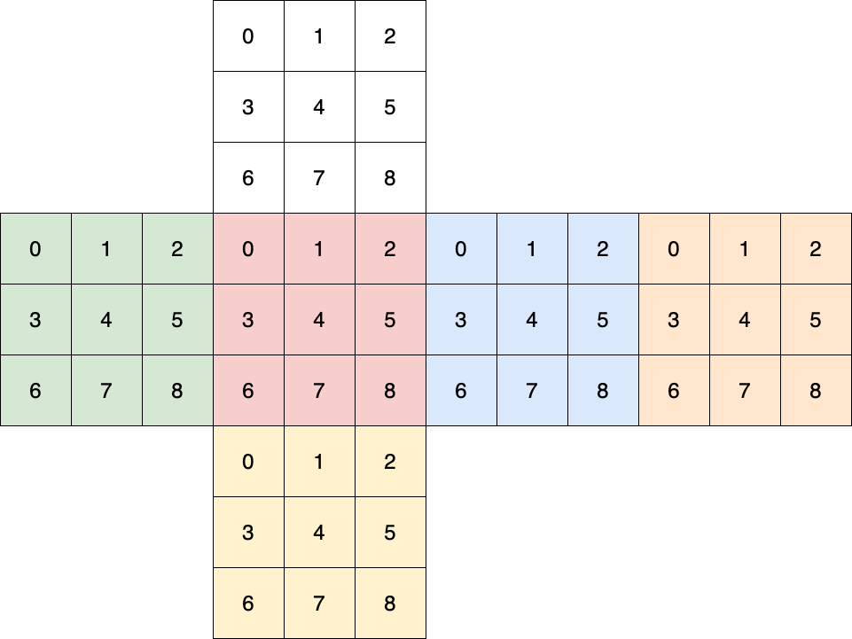
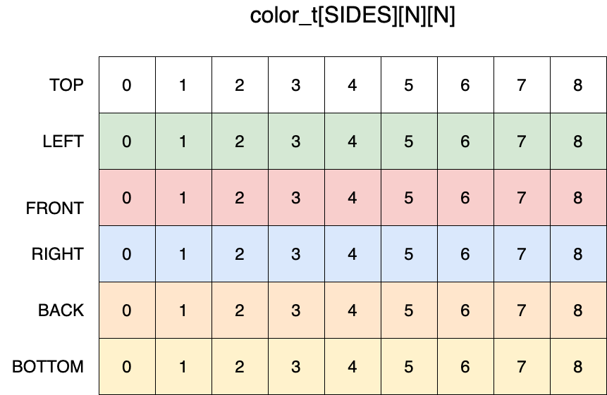

# Rubiks-buster

## Description

This goal of this project is to simulate and scramble an N × N × N Rubik's cube and compare the speed of both a sequential and parallel solution for finding the shortest series of rotations to solve the cube.

The first step to representing a cube is to define an enumerated type of the 6 possible colors. Each the 6 faces of the cube can be represented as an N × N array of these colors. The cube itself is then the collection of these six sides. They have been indexed according to the following diagrams:

Next, we need to figure out how to define a rotation that acts on our cube. These can be defined by three values: the axis of rotation, the index of the plane relative to that axis, and the direction of the rotation. With these three values, we defined functions to perform these rotations on the edges of the plane and if applicable, it's exterior face.

Once we have a method for representing a Rubik's cube and any actions that can change it's state, we can develop our methods to, when provided a scrambled cube, find the fewest number of rotations to unscramble it.

The sequential solution works by...

## How to run

### Dependencies

1. [Open MPI](https://www.open-mpi.org/)
2. []

## Completed Tasks

1. Represent a Rubik's Cube
2. Perform rotations on a Rubik's Cube
3. Display a Rubik's Cube
4. Initialize and scramble a Rubik's Cube
5. Sequentially unscramble a Rubik's Cube

## Uncompleted Tasks (Bugs)

## Uncompleted Tasks (Time)

1. Backtracking/loop prevention.
2. Curses visualization.
3. Non-square combination puzzles.

## Time Log

### Alex's Time

| Date  | Hours | Notes                                                                                     |
|-------|-------|-------------------------------------------------------------------------------------------|
| 06-15 | 2:00  | Working on setting up the representation of the cube as well as the methods to rotate it. |
| 06-16 | 1:30  | Working on implementing the rotate functions.                                             |
| 06-16 | 2:00  | Working on the rotate functions.                                                          |
| 06-16 | 1:20  | Worked on developing a naive display function.                                            |
| 06-20 | 3:00  | Updated the display and rotate functions to work with the new indexing method.            |
| 06-21 | 3:00  | Created a stack for storing the actions taken and whether we are backtracking.            |
| 06-21 | 2:00  | Created diagrams and started working on presentation.                                     |
| 06-22 | 1:00  | Working on the ReadMe                                                                     |
| 06-22 | 1:20  | Debugged and added a timer to calculate speedup.                                          |
| Total | 17:10 |                                                                                           |

### Andrew's Time

| Date  | Hours | Notes                                                                                                                             |
|-------|-------|-----------------------------------------------------------------------------------------------------------------------------------|
| 06-15 | 3:00  | Working on initialization and rotation methods created makefile                                                                   |
| 06-16 | 3:00  | Wrote function to check if cube is solved, refactored code to use stuct to track movement                                         |
| 06-17 | 3:00  | Rewrote scramble, Started work on RUBIKS_SEQENTIAL, started work on how to find identical rotations                               |
| 06-19 | 6:00  | Rewrote scramble, Started rewriting cube implementation, It was a mess and broken, now it less of a mess and still broken         |
| 06-19 | 4:00  | Spent 4 hours chasing down a bug that was an outdated pair initialization and verification functions... rotate now passes test... |
| 06-20 | 4:00  | Implemented working recursive solution, reimplemented verifyValid again, added new solution type, added solution depth limit      |
| Total | 23:00 |                                                                                                                                   |

## Contributors

- [Alex Clarke](https://github.com/alexpclarke)
- [Andrew Pobrica](https://github.com/crispyman)

## License

[MIT](https://github.com/alexpclarke/Haskell-Turing-Machine/blob/master/LICENSE)